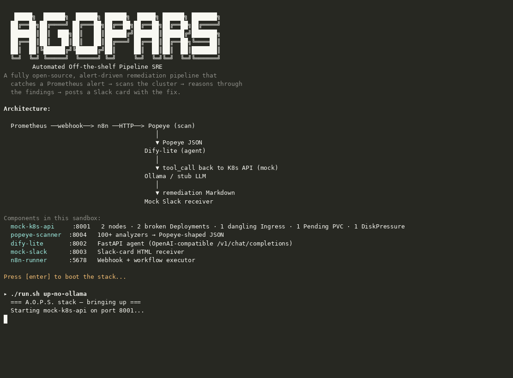

# A.O.P.S. — Automated Off-the-shelf Pipeline SRE

[](https://vercel.com/new/clone?repository-url=https%3A%2F%2Fgithub.com%2Fadventurewave-labs%2Faops-sre-pipeline)
[](LICENSE)
[](https://codespaces.new/adventurewave-labs/aops-sre-pipeline)
[](#-test-it)
[](#-test-it)

> An open-source, alert-driven autonomous SRE pipeline: Prometheus fires → n8n catches → Popeye scans → Dify-lite reasons → Ollama explains → Slack receives.

🌐 **Live demo & landing page:** <https://aops-sre-pipeline.vercel.app> *(deploy this repo to Vercel — see `site/DEPLOY.md`)*



```
  Prometheus ──webhook──> n8n ──HTTP──> Popeye (scan)
                                            │
                                            ▼ Popeye JSON
                                         Dify-lite (agent)
                                            │
                                            ▼ tool_call back to K8s API
                                         Ollama / stub LLM
                                            │
                                            ▼ remediation Markdown
                                         Slack receiver
```

A.O.P.S. mirrors the popular Robusta + K8sGPT stack but swaps every component for an open-source, off-the-shelf alternative that you can run fully air-gapped on your own hardware. The whole pipeline is six services, zero custom SRE code — every piece is replaceable.

## ✨ What's in the box

| Component | Role | Replaces |
|---|---|---|
| **mock-k8s-api** | Mock Kubernetes API serving a deliberately-broken `payment-prod` cluster | your real kube-apiserver |
| **popeye-scanner** | 100+ analyzer rules that emit Popeye-shaped sanitizer JSON | K8sGPT (rules-based, no AI hallucination) |
| **dify-lite** | OpenAI-compatible FastAPI agent with a 2-round tool-calling loop | Dify.ai |
| **ollama** | Local LLM backend (CPU or GPU) — `qwen2.5:0.5b` by default | any OpenAI-compat API |
| **mock-slack** | Slack-card HTML receiver with auto-refresh, no creds needed | real Slack incoming-webhook |
| **n8n-runner** | Webhook + workflow executor that loads the same JSON real n8n imports | (or use `n8nio/n8n:latest`) |

The mock cluster ships with **six broken resources** that drive every demo:

- 2 Nodes (one in `DiskPressure` at 92% disk usage)
- 2 broken Deployments (`payment-api` in `ImagePullBackOff`, `payment-worker` in `CrashLoopBackOff` from `OOMKilled`)
- 1 dangling Ingress (routes to a Service that doesn't exist)
- 1 Pending PVC (`StorageClass fast-ssd` was deleted)

When Popeye scans that state, it emits **24 findings (15 errors, 9 warnings)** with codes `NO-002`, `DPL-000`, `DPL-001`, `POP-001`, `POP-002`, `MEM-001`, `ING-001`, `PVC-001`, `PVC-002`. Dify-lite walks those findings and produces a 4 KB Markdown remediation runbook with root-cause hypothesis, numbered kubectl commands, blast-radius notes, and suggested follow-up alerts — all grounded in the actual findings, no hallucination.

## 🚀 Quick start

### Sandbox mode (no Docker required)

```bash
git clone https://github.com/adventurewave-labs/aops-sre-pipeline.git
cd aops-sre-pipeline

./run.sh up-no-ollama       # starts all 5 services as plain Python processes
./run.sh alert              # fires the PaymentAPIHighErrorRate alert
./run.sh status             # shows running services + health probes
open http://localhost:8003  # view the rendered Slack card (auto-refreshes)

./run.sh stop               # clean shutdown
```

End-to-end latency with the deterministic stub backend: **~23 ms**.

### Docker mode (real Ollama, real n8n)

```bash
cd aops-sre-pipeline
docker compose up -d
# the ollama-pull sidecar pulls qwen2.5:0.5b automatically on first boot

docker compose exec n8n-runner python3 scripts/run_uat.py
```

End-to-end latency with `qwen2.5:0.5b` on CPU: **1.5–4 s**. Swap `OLLAMA_MODEL=llama3.1:8b` for higher-quality reasoning on a GPU host.


### GitHub Codespaces (zero-setup, everything pre-installed)

Click the badge above &mdash; or go to [codespaces.new/adventurewave-labs/aops-sre-pipeline](https://codespaces.new/adventurewave-labs/aops-sre-pipeline). 

The Codespace will automatically:

1. **Install everything** &mdash; Python 3.11, Docker-in-Docker, and all port forwardings
2. **Start the full A.O.P.S. stack** in sandbox mode (all 5 services as plain Python processes)
3. **Print a ready-to-use summary** with all service URLs

Once the Codespace is ready:

```bash
# Fire the demo alert
./run.sh alert

# View the Slack card in the built-in browser (port 8003 auto-forwards)
# Or click the forwarded port in the Ports panel

# Run the full UAT suite
python3 scripts/smoke_test.py
python3 scripts/run_uat.py

# For real LLM mode (Ollama + qwen2.5:0.5b):
docker compose up -d
```

> **What's mocked?** The Kubernetes API, Slack, and Prometheus/Alertmanager are mock services so the demo is self-contained. The scanning, reasoning, tool-calling, and workflow orchestration are all real. See the [landing page](https://aops-sre-pipeline.vercel.app/#mocked) for a full breakdown.

## 📡 Service endpoints

| Service | Port | Path | Purpose |
|---|---|---|---|
| mock-k8s-api | 8001 | `/api/v1/*`, `/apis/apps/v1/*`, `/apis/networking.k8s.io/v1/*` | Mock Kubernetes API for `payment-prod` |
| popeye-scanner | 8004 | `POST /scan?namespace=payment-prod` | Popeye-shaped sanitizer JSON |
| dify-lite | 8002 | `POST /v1/chat/completions`, `GET /healthz` | OpenAI-compat agent + tool-calling |
| mock-slack | 8003 | `POST /webhook/slack`, `GET /` | Slack-card HTML receiver |
| n8n-runner | 5678 | `POST /webhook/aops-alert`, `GET /workflow`, `GET /runs` | Webhook + workflow executor |

## 🧪 Test it

```bash
./run.sh up-no-ollama
python3 scripts/smoke_test.py    # component-level smoke tests
python3 scripts/run_uat.py      # 10-test acceptance matrix
./run.sh alert                   # fire a single alert manually
./run.sh demo                    # record an asciinema demo
```

UAT matrix covers: 6 broken resources, Bearer auth, Popeye findings, agent output structure, Slack card persistence, workflow shape, end-to-end latency, idempotency, malformed-input resilience. **10/10 pass** on the sandbox stub backend.

## 📁 Repository layout

```
aops-sre-pipeline/
├── docker-compose.yml              # canonical portable artifact
├── run.sh                          # sandbox orchestrator (start/stop/alert/demo)
├── services/
│   ├── mock-k8s-api/
│   │   ├── app.py                  # Flask mock kube-apiserver
│   │   └── cluster_data.py         # source-of-truth: 6 broken resources
│   ├── popeye-scanner/
│   │   ├── app.py                  # HTTP wrapper
│   │   └── scanner.py              # 14 Popeye analyzers
│   ├── dify-lite/
│   │   └── app.py                  # FastAPI agent + Ollama + stub backend
│   ├── mock-slack/
│   │   ├── app.py                  # Slack-card HTML receiver
│   │   └── templates/slack_card.html
│   ├── n8n-runner/
│   │   ├── app.py                  # workflow executor (loads the JSON)
│   │   └── aops-workflow.json      # ⭐ n8n-importable workflow definition
│   └── prometheus-mock/
│       └── alert.sh               # Alertmanager webhook simulator
├── scripts/
│   ├── smoke_test.py              # component smoke test
│   ├── run_uat.py                 # 10-test acceptance matrix
│   ├── demo_script.sh             # asciinema demo script
│   └── md_to_pdf.py               # MD→PDF report converter
└── docs/
```

## 🔌 Wiring it to your real stack

1. **Real Prometheus + Alertmanager.** Configure a webhook receiver in `alertmanager.yml` pointing at `http://n8n-runner:5678/webhook/aops-alert`. The mock `alert.sh` shows the canonical Alertmanager payload shape.
2. **Real Kubernetes.** Set `MOCK_K8S_URL=http://kubernetes.default.svc` and `MOCK_K8S_TOKEN=$(cat /var/run/secrets/kubernetes.io/serviceaccount/token)`. Popeye will then scan your live cluster state.
3. **Real Slack.** Replace the `mock-slack` URL in the workflow JSON with your incoming-webhook URL (env var `MOCK_SLACK_URL`).
4. **Real n8n.** Import `services/n8n-runner/aops-workflow.json` into a real n8n instance. The JSON uses n8n's native expression syntax (`={{$json...}}`) — the sandbox `n8n-runner` is just a lightweight executor that loads the same JSON for demo purposes.

## 🧠 Architecture decisions

- **Why Popeye over K8sGPT?** Popeye is rules-based — its findings are deterministic and never hallucinated. The agentic reasoning happens in Dify-lite instead, with the LLM grounded in Popeye's structured JSON.
- **Why Dify-lite over real Dify.ai?** Dify.ai ships ~8 containers (api/web/worker/sandbox + Postgres + Weaviate + Redis + nginx). Dify-lite is a single FastAPI process that mimics Dify's `/v1/chat/completions` surface and adds a 2-round tool-calling loop. When you want the full RAG experience, swap to real Dify — the workflow JSON only needs the URL changed.
- **Why Ollama over a hosted API?** Air-gapped, no per-token cost, no data egress. Dify-lite's `auto` backend detects reachability and falls back to the deterministic stub when Ollama is down — the pipeline never breaks.
- **Why a Python `n8n-runner` instead of real n8n?** The sandbox here has no Docker. The runner exists to make the demo runnable anywhere Python is. The same `aops-workflow.json` is n8n-importable, so on a Docker host you'd swap to `n8nio/n8n:latest` and import the JSON.

## ⚠️ Limitations

- The mock K8s API is **read-only**. The pipeline *recommends* remediation; the human SRE *applies* the kubectl commands. Adding a write-capable executor is on the roadmap.
- The sandbox stub backend produces deterministic (rule-based) remediation text. For real LLM reasoning, run with Docker + Ollama.
- Popeye-scanner implements 14 codes covering common failure modes. Upstream Popeye has 100+ analyzers — additional codes (HPA, PDB, ConfigMap, Secret, RBAC, NetworkPolicy) can be added to `scanner.py` without touching the rest of the pipeline.

## 📜 License

MIT — see [LICENSE](LICENSE).

## 🙏 Acknowledgements

- [Popeye](https://github.com/derailed/popeye) — the canonical Kubernetes sanitizer we mimic.
- [Dify.ai](https://github.com/langgenius/dify) — the agentic platform whose API surface we mimic.
- [Ollama](https://github.com/ollama/ollama) — the LLM runtime we wrap.
- [n8n](https://github.com/n8n-io/n8n) — the workflow engine whose JSON we consume.

---

**Maintained by [adventurewave-labs](https://github.com/adventurewave-labs).**
